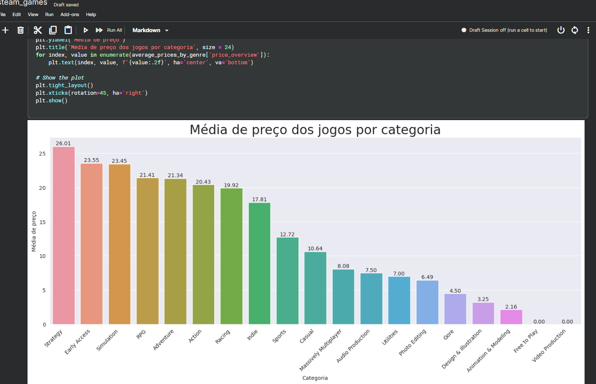
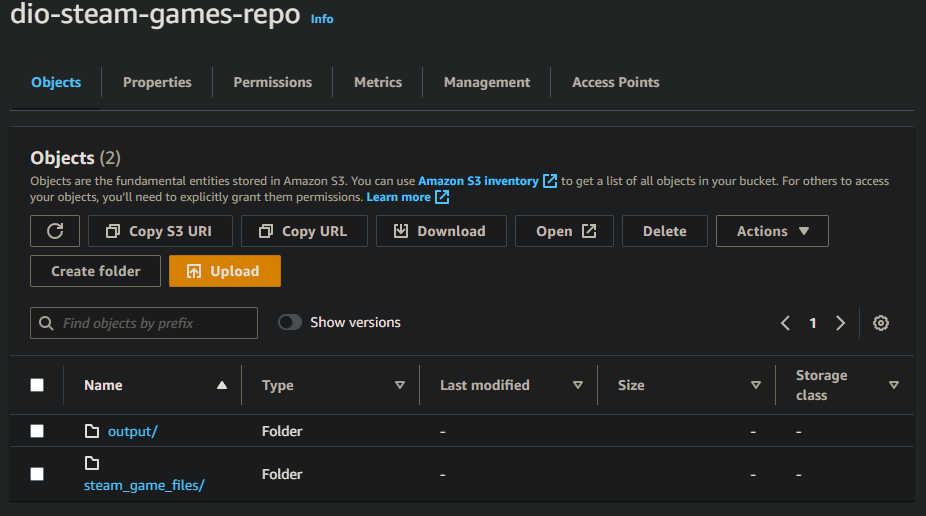
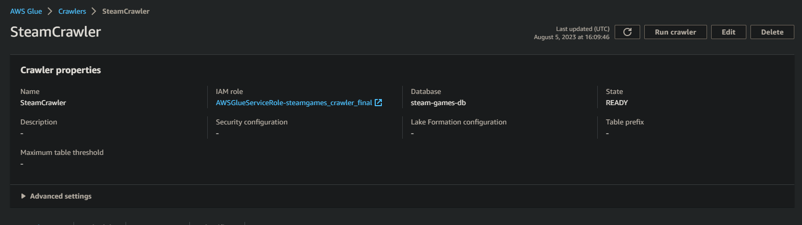
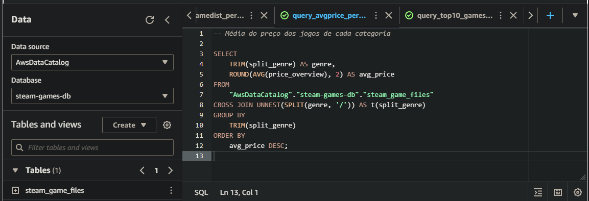

# DIO-Engenharia de dados de jogos da steam com AWS

## Tecnologias e serviços utilizados:
- Amazon S3
- Amazon Glue
- Amazon Athena
- Python

## Etapas Realizadas Para o desenvolvimento do projeto
1. Extração e manipulação dos dados no kaggle. [link do dataset](https://www.kaggle.com/datasets/joebeachcapital/top-1000-steam-games?select=steam_app_data.csv)

2. Etapa de EDA com python e pandas.
    
3. Criação do bucket na Amazon S3.
    
4. Desenvovendo um crawler.
    
5. Criando Queries no Amazon Athena.
    

